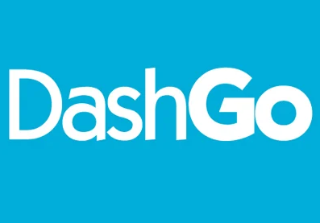

<p align="center">
   
</p>

> **dashgo** é o quarto projeto criado no chapter 4 da trilha de React do Ignite da [Rocketseat](https://github.com/Rocketseat). O projeto consiste em desenvolver uma aplicação Dashboard utilizando Chakra UI.

# :pushpin: Conteúdo

- [Tecnologias](#computer-tecnologias)
- [Executando](#construction_worker-executando)
- [Desafios](#atom_symbol-desafios)

# :computer: Tecnologias

Este projeto foi feito utilizando as seguintes tecnologias:

- [React](https://reactjs.org/)
- [Typescript](https://www.typescriptlang.org/)
- [NextJS](https://nextjs.org/)
- [Chakra UI](https://chakra-ui.com/)
- [ESLint](https://eslint.org/)
- [Prettier](https://prettier.io/)

# :construction_worker: Executando

```bash
# Clone o Repositório
$ git clone https://github.com/igorrochadasilva/rockeatseat-reactjs.git
```

```bash
# Acesse a pasta do projeto
cd Chapter4/dashgo
```

```bash
# Baixe as dependendências
yarn
```

```bash
# Execute o projeto
yarn start
```

Acesse <http://localhost:3000> para ver o resultado.

# :atom_symbol: Desafios

[Desafio 6](https://github.com/igorrochadasilva/rocketseat-desafio-6): Desafio criando um Blog utilizando NextJS e Chakra UI.
